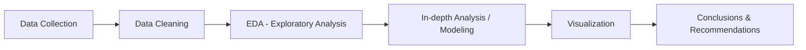

<div align="center">

# Customer Churn Analytics:

### Customer churn is a key concern for subscription-based businesses, where retaining existing customers is often more valuable than acquiring new ones. This project explores a simulated dataset of 20,000 customers to identify which factors — such as contract type, support calls, and tenure — are most associated with churn, using exploratory data analysis and segmentation techniques in Python.
 
[](https://www.python.org/)
[](https://pandas.pydata.org/)
[](#)
[](#)
[](LICENSE)
 
</div>

---
 
## 📌 Table of Contents
- [Overview](#-overview)
- [Business Questions](#-business-questions)
- [Dataset](#-dataset)
- [Tech Stack](#-tech-stack)
- [Analysis Workflow](#-analysis-workflow)
- [Key Insights](#-key-insights)
- [Results & Recommendations](#-results--recommendations)
- [Project Structure](#-project-structure)
- [How to Run](#-how-to-run)
- [Contact](#-contact)
---
 
## 🔍 Overview
 
> Write 3-4 sentences summarizing what data you analyzed, why, and the most notable result.
 
**Example:** This project analyzes the purchasing behavior of over 50,000 customers over a 2-year period to identify the drivers of churn and recommend retention strategies. The analysis uncovered 3 key factors influencing churn, suggesting the business could reduce churn rate by 15% by implementing the proposed actions.
 
---
 
## ❓ Business Questions
 
- Question 1: *[e.g., Which customer segment has the highest churn risk?]*
- Question 2: *[e.g., What factor most influences revenue by region?]*
- Question 3: *[e.g., How does purchasing behavior change seasonally?]*
---
 
## 🗂 Dataset
 
| Attribute | Detail |
|---|---|
| **Source** | [e.g., Kaggle / Company API / Web scraping] |
| **Size** | [e.g., 50,000 rows × 15 columns] |
| **Time period** | [e.g., Jan 2023 – Dec 2024] |
| **Format** | CSV / SQL Database / JSON |
 
**Dataset link:** [link to dataset]
 
---
 
## 🛠 Tech Stack
 
<table>
<tr>
<td><b>Processing & Analysis</b></td>
<td>Python (Pandas, NumPy), SQL</td>
</tr>
<tr>
<td><b>Visualization</b></td>
<td>Matplotlib, Seaborn, Power BI / Tableau</td>
</tr>
<tr>
<td><b>Statistics / ML</b></td>
<td>Scikit-learn, Statsmodels</td>
</tr>
<tr>
<td><b>Other Tools</b></td>
<td>Jupyter Notebook, Excel, Git</td>
</tr>
</table>
---
 
## 🔄 Analysis Workflow
 

 
1. **Data Collection & Cleaning**: handling missing values, outliers, format standardization.
2. **EDA (Exploratory Data Analysis)**: exploring distributions and correlations between variables.
3. **In-depth Analysis**: hypothesis testing, customer segmentation, predictive modeling (if applicable).
4. **Visualization**: building dashboards/charts to clearly present insights.
5. **Conclusion**: summarizing findings and providing concrete action recommendations.
---
 
## 💡 Key Insights
 
> Replace placeholder images with your actual charts (dashboard screenshots, matplotlib plots...)
 
| Insight | Evidence |
|---|---|
| 🔹 [e.g., 20% of VIP customers generate 60% of revenue] |  |
| 🔹 [e.g., Highest churn rate is among Free-tier users] |  |
| 🔹 [e.g., Revenue peaks sharply every Q4] |  |
 
---
 
## ✅ Results & Recommendations
 
- **Result 1:** [Summarize the most important finding]
- **Result 2:** [Second finding]
- **Recommended actions:**
  - [e.g., Focus retention campaigns on high-churn-risk segments]
  - [e.g., Reallocate marketing budget toward regions with the highest ROI]
**Expected impact:** [e.g., Could reduce churn rate by 15% / increase revenue by 8% if implemented]
 
---
 
## 📁 Project Structure
 
```
project-name/
│
├── data/
│   ├── raw/                # Raw data
│   └── processed/          # Cleaned/processed data
│
├── notebooks/
│   ├── 01_data_cleaning.ipynb
│   ├── 02_eda.ipynb
│   └── 03_analysis.ipynb
│
├── images/                 # Charts, dashboard screenshots
├── src/                     # Reusable Python scripts
├── report.pdf               # Summary report (if any)
├── requirements.txt
└── README.md
```
 
---
 
## ▶️ How to Run
 
```bash
# 1. Clone the repository
git clone https://github.com/username/project-name.git
cd project-name
 
# 2. Create a virtual environment and install dependencies
pip install -r requirements.txt
 
# 3. Run the notebook
jupyter notebook notebooks/01_data_cleaning.ipynb
```
 
---
 
## 📬 Contact
 
<div align="center">
**[Your Name]**
 
[](#)
[](#)
[](#)
 
⭐ If you found this project useful, consider leaving a star!
 
</div>
