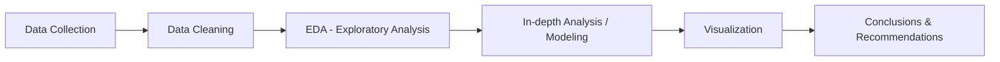
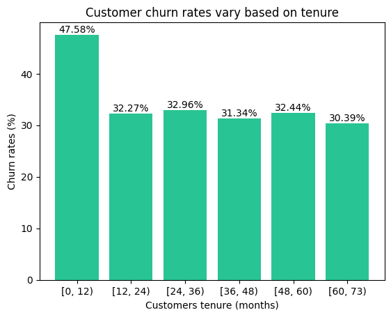
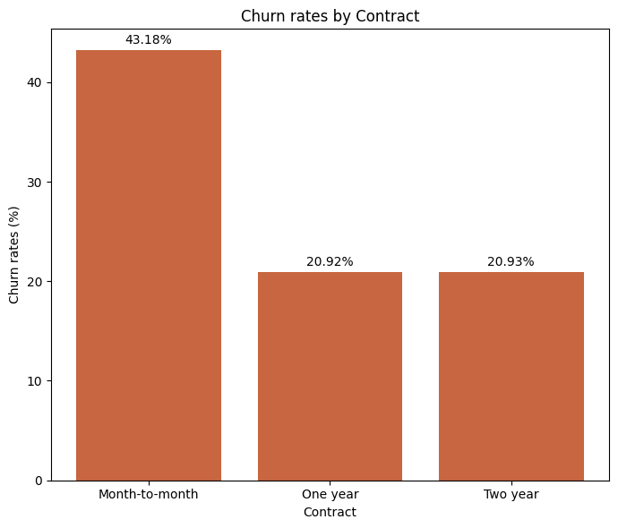
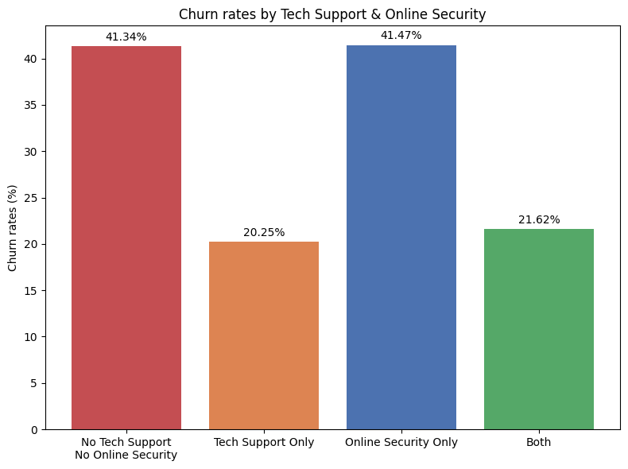

# Customer Churn Analytics:

### Customer churn is a key concern for subscription-based businesses, where retaining existing customers is often more valuable than acquiring new ones. This project explores a simulated dataset of 20,000 customers to identify which factors — such as contract type, support calls, and tenure — are most associated with churn, using exploratory data analysis and segmentation techniques in Python.
 

 

---
 
## 📌 Table of Contents
- [Overview](#-overview)
- [Business Questions](#-business-questions)
- [Dataset](#-dataset)
- [Tech Stack](#-tech-stack)
- [Analysis Workflow](#-analysis-workflow)
- [Key Insights](#-key-insights)
- [Contact](#-contact)
---
 
## 🔍 Overview
 
> Write 3-4 sentences summarizing what data you analyzed, why, and the most notable result.
 
**Example:** This project analyzes the purchasing behavior of over 50,000 customers over a 2-year period to identify the drivers of churn and recommend retention strategies. The analysis uncovered 3 key factors influencing churn, suggesting the business could reduce churn rate by 15% by implementing the proposed actions.
 
---
 
## ❓ Business Questions
 
- Question 1: *What is the current churn situation?*
- Question 2: *What factors are associated with churn?*
- Question 3: *Which customer groups have high churn rates?*
- Question 4: *Which groups should the business focus on retaining?*
---
 
## 🗂 Dataset
 
| Attribute | Detail |
|---|---|
| **Source** | [e.g., Kaggle / Company API / Web scraping] |
| **Size** | [e.g., 50,000 rows × 15 columns] |
| **Time period** | [e.g., Jan 2023 – Dec 2024] |
| **Format** | CSV / SQL Database / JSON |
 
**Dataset link:** [link to dataset]
 
---
 
## 🛠 Tech Stack
 
<table>
<tr>
<td><b>Processing & Analysis</b></td>
<td>Python (Pandas, NumPy), SQL</td>
</tr>
<tr>
<td><b>Visualization</b></td>
<td>Matplotlib, Seaborn, Power BI / Tableau</td>
</tr>
<tr>
<td><b>Statistics / ML</b></td>
<td>Scikit-learn, Statsmodels</td>
</tr>
<tr>
<td><b>Other Tools</b></td>
<td>Jupyter Notebook, Excel, Git</td>
</tr>
</table>
 
## 🔄 Analysis Workflow
 

 
1. **Data Collection & Cleaning**: handling missing values, outliers, format standardization.
2. **EDA (Exploratory Data Analysis)**: exploring distributions and correlations between variables.
3. **In-depth Analysis**: hypothesis testing, customer segmentation, predictive modeling (if applicable).
4. **Visualization**: building dashboards/charts to clearly present insights.
5. **Conclusion**: summarizing findings and providing concrete action recommendations.
---
 
## 💡 Key Insights
 
| Insight | Evidence |
|---|---|
| 🔹 Customers in their first 12 months churn at 47.58%, notably higher than the 31-32% churn rate seen among longer-tenured customers, after which the rate stabilizes |  |
| 🔹 Customers with monthly contracts (month-to-month) have a significantly higher churn rate than those with annual contracts (a difference of 22.26 percentage points) |  |
| 🔹 Customers without tech support — regardless of whether they have online security — churn at more than double the rate of those with tech support. Online security alone has little protective effect |  |
 
---
 
## 📬 Contact
 

**[Your Name]**
 

 

